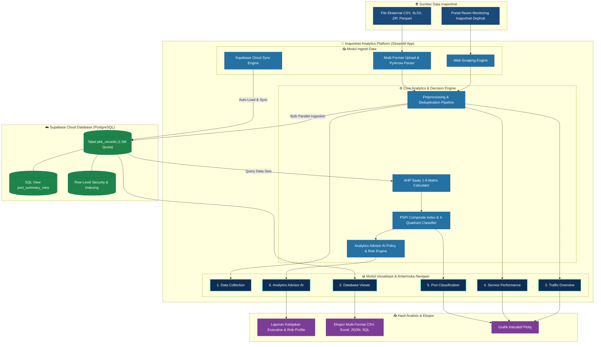

# 🚢 Inaportnet Analytics (feat. AHP Scientifically Weighted & Analytics Advisor)

[](https://www.python.org/)
[](https://streamlit.io/)
[](https://supabase.com/)
[](LICENSE)

Platform analitik dan pemantauan performa layanan **Inaportnet (Kementerian Perhubungan Republik Indonesia)** mencakup **259+ pelabuhan di seluruh Indonesia** sepanjang tahun 2025. Platform ini mengevaluasi kepatuhan *Service Level Agreement* (SLA approval < 30 menit) persetujuan kedatangan kapal (PKK) serta mengklasifikasikan efisiensi operasional pelabuhan berbasis metode saintifik **Analytical Hierarchy Process (AHP)** dan dilengkapi fitur cerdas **Analytics Advisor (Policy & Risk)**.

---

## 📋 Daftar Isi

- [📌 Tentang Aplikasi](#-tentang-aplikasi)
- [🎯 Kegunaan &amp; Fitur Utama](#-kegunaan--fitur-utama)
- [🏗️ Arsitektur Aplikasi](#%EF%B8%8F-arsitektur-aplikasi)
- [💻 Prasyarat &amp; Panduan Instalasi](#-prasyarat--panduan-instalasi)
  - [1. Instalasi &amp; Menjalankan di Lokal](#1-instalasi--menjalankan-di-lokal)
  - [2. Deploy ke Server / Streamlit Cloud](#2-deploy-ke-server--streamlit-cloud)
- [⚠️ Keterbatasan Aplikasi](#%EF%B8%8F-keterbatasan-aplikasi)
- [📚 Rujukan Dokumen](#-rujukan-dokumen)
- [☕ Traktir Kopi Biar Semangat](#-traktir-kopi-biar-semangat)

---

## 📌 Tentang Aplikasi

Aplikasi **Inaportnet Analytics Dashboard** dibangun untuk memberikan visibilitas komprehensif terhadap performa operasional pelayanan publik di sektor maritim Indonesia. Dengan mengintegrasikan otomatisasi pengumpulan data (*web scraping*), pembersihan data terstruktur (*preprocessing & deduplication*), penyimpanan berbasis awan (*Supabase Cloud* dengan mesin pengunduh multithreading), metode pengambilan keputusan kriteria majemuk (**AHP Saaty 1-9**), serta modul kecerdasan **Analytics Advisor**, platform ini menyajikan analisis 4 kuadran pelabuhan secara objektif untuk mendukung perumusan kebijakan logistik nasional.

**Demo aplikasi 👇**

[inaportnetanalytics-ahp.streamlit.app](https://inaportnetanalytics-ahp.streamlit.app/)

**Karya tulis ilmiah**

......

**Video Demo Aplikasi**

.........

---

## 🎯 Kegunaan & Fitur Utama

1. **🌐 Data Collection & Automated Ingestion (`1_📊_Data_Collection.py`)**:

   - **Web Scraping**: Pengambilan data PKK otomatis dari portal resmi Inaportnet Dephub per pelabuhan, tahun, dan jenis angkutan (domestik `dn` & luar negeri `ln`).
   - **Upload Multi-Format**: Unggah file eksternal skala besar (`.csv`, `.xlsx`, `.zip`, `.parquet`) hingga **500 MB** dengan parsing multi-threading PyArrow.
   - **Tab 3: ☁️ Load dari Supabase**: Fitur sinkronisasi langsung data Supabase dengan *real-time metrics*, *interactive progress bar*, dan perkiraan waktu selesai (*ETA timer*).
   - **Global Sidebar Sync Widget**: Widget sinkronisasi cepat yang tersedia di sidebar seluruh halaman dasbor.
2. **🗄️ Live Database Viewer (`2_🗄️_Database_Viewer.py`)**:

   - Ditempatkan tepat setelah Data Collection untuk navigasi cepat penjelajahan database.
   - Penjelajah tabel Supabase secara *live* dengan pencarian kata kunci interaktif & pagination.
   - Ekspor data hasil olahan ke format **CSV**, **Excel** (dengan pembersihan otomatis zona waktu), **JSON**, dan **SQL Dump**.
3. **🚦 Traffic Overview (`3_🚦_Traffic_Overview.py`)**:

   - Analisis volume pergerakan kedatangan kapal (PKK) tahunan, bulanan, harian, dan jam sibuk.
   - Filter interaktif per pelabuhan dan jenis angkutan domestik vs luar negeri.
4. **📋 Service Performance & SLA Monitoring (`4_📋_Service_Performance.py`)**:

   - Evaluasi durasi waktu persetujuan (*approval time*) dari submit pengajuan hingga terbit izin.
   - Indikator Kepatuhan SLA (Standar < 31 menit): Tingkat persentase kelulusan SLA, rata-rata durasi, dan nilai median durasi.
   - Distribusi statistik dan visualisasi boxplot per pelabuhan.
5. **🗺️ Port Classification & AHP Index (`5_🗺️_Port_Classification.py`)**:

   - **Skema AHP Scientifically Weighted**: Pembobotan 4 kriteria utama (*Compliance Index*, *Robustness Index*, *Efficiency Index*, dan *Consistency Index*) dengan skala perbandingan berpasangan Saaty (1-9) dan rasio konsistensi **Consistency Ratio (CR = 0.0402 < 0.10)**.
   - **Analisis 4 Kuadran Pelabuhan**:
     - 🏆 **Benchmark Port**: Volume tinggi & performa efisien.
     - ⚡ **Efficient Port**: Volume sedang/rendah dengan respon sangat cepat.
     - 🚦 **Congested Port**: Workload sangat tinggi yang mengalami potensi *bottleneck*.
     - 🛠️ **Developing Port**: Pelabuhan yang memerlukan peningkatan efisiensi operasional.
   - Skema perbandingan bobot (*AHP Saaty* vs *Equal Weight 25%* vs *Custom Weight*).
6. **🤖 Analytics Advisor (Policy & Risk) (`6_🤖_Analytics_Advisor.py`)**:

   - **Halaman Dedicated Baru**: Terletak setelah Port Classification dengan tampilan antarmuka *glassmorphism executive layout*.
   - **Evaluasi Pelabuhan Spesifik**: Pilih pelabuhan dari dropdown interaktif untuk memperoleh 5 poin pendapat analisis AI:
     1. **Bobot Prioritas AHP & Evaluasi Kriteria**: Breakdown skor kriteria pelabuhan terpilih ($S_{CI}, S_{RI}, S_{EI}, S_{CsI}$) beserta bobot global ($W_{CI}=47.1\%, W_{RI}=28.4\%, W_{EI}=17.2\%, W_{CsI}=7.4\%$).
     2. **Simpulan Uji Konsistensi Saaty (CR vs CI)**: Verifikasi matematis konsistensi matriks perbandingan berpasangan ($CR = 4.02\% \le 10\%$).
     3. **Implikasi Kebijakan Operasional**: Rekomendasi manajerial strategis bagi pimpinan Kemenhub & Pelindo.
     4. **Pernyataan Risiko Masa Depan**: Proyeksi dampak (*Demurrage Cost*, *Supply Chain Bottleneck*, dan *LPI Reputation Impact*) lengkap dengan *Badge* Profil Risiko (**RENDAH**, **SEDANG**, **TINGGI**).
     5. **Tabel Peringkat Kinerja Pelabuhan Lengkap**: Tabel pembanding peringkat seluruh pelabuhan nasional dari yang terbaik (#1) hingga terburuk (#N).

---

## 🏗️ Arsitektur Aplikasi



### Struktur Direktori Repository:

```text
inaportnetAnalytics/
│
├── data/                          # Data referensi pelabuhan (port_code.xlsx)
├── outputs/                       # File grafik dan hasil visualisasi ekspor
├── papers/                        # Riset & Dokumen Referensi AHP
│   └── AHP_Analysis_Tool rev.xlsx # Spreadsheet Model AHP Saaty 1-9 (CR = 0.0402)
│
├── inaportnetDashboard/           # Direktori Utama Dashboard Streamlit
│   ├── app.py                     # Halaman Utama (Beranda & Navigation)
│   ├── requirements.txt           # Dependensi pustaka Python
│   ├── supabase_schema.sql        # Skema SQL tabel, index, & RLS policy
│   ├── .streamlit/
│   │   ├── config.toml            # Tema & konfigurasi server Streamlit
│   │   └── secrets.toml           # Kredensial Supabase (URL & Service Role Key)
│   │
│   ├── modules/                   # Modul Logika & Core Engine
│   │   ├── database.py            # Operasi CRUD, Multithread Ingestion, & Supabase Client
│   │   ├── scraper.py             # Engine web-scraping portal Inaportnet
│   │   ├── preprocessing.py       # Pembersihan data & validasi file
│   │   ├── analysis.py            # Kalkulasi Indeks Performa PSPI, AHP Matrix, & AI Advisor
│   │   └── visualization.py       # Grafik interaktif Plotly
│   │
│   └── pages/                     # Halaman Multi-Page Dashboard
│       ├── 1_📊_Data_Collection.py     # Scraping, Upload, & Sync Supabase
│       ├── 2_🗄️_Database_Viewer.py     # Live Database Explorer & Multi-Format Export
│       ├── 3_🚦_Traffic_Overview.py     # Analisis Volume & Tren PKK
│       ├── 4_📋_Service_Performance.py # Analisis SLA & Durasi Approval
│       ├── 5_🗺️_Port_Classification.py # Klasifikasi Kuadran & AHP Index
│       └── 6_🤖_Analytics_Advisor.py   # AI Policy & Risk Advisor Pelabuhan
│
├── workflow.md                    # Dokumentasi alur kerja analisis
└── README.md                      # Dokumentasi Utama Repository
```

---

## 💻 Prasyarat & Panduan Instalasi

### Prasyarat Sistem:

- **Python**: Versi `3.9` atau yang lebih baru.
- **Database**: Akun proyek [Supabase](https://supabase.com/) aktif.

---

### 1. Instalasi & Menjalankan di Lokal

1. **Clone Repository**:

   ```PowerShell
   git clone https://github.com/ekacs/inaportnetAnalytics.git
   cd inaportnetAnalytics/inaportnetDashboard
   ```
2. **Buat & Aktifkan Virtual Environment**:

   - **Windows (PowerShell)**:
     ```powershell
     python -m venv venv
     .\venv\Scripts\Activate.ps1
     ```
   - **Linux / macOS**:
     ```Shell
     python3 -m venv venv
     source venv/bin/activate
     ```
3. **Install Dependensi**:

   ```Shell
   pip install -r requirements.txt
   ```
4. **Konfigurasi Kredensial Database (`.streamlit/secrets.toml`)**:
   Buat atau sunting file `inaportnetDashboard/.streamlit/secrets.toml`:

   ```toml
   SUPABASE_URL = "https://your-project-id.supabase.co"
   SUPABASE_KEY = "your-service-role-key"  # Gunakan service_role key untuk bypass RLS
   MAX_SUPABASE_RECORDS = 1500000          # Batas kuota penyimpanan (opsional)
   ```
5. **Eksekusi Skema Database**:
   Salin dan jalankan isi file `supabase_schema.sql` pada **Supabase SQL Editor** Anda untuk membuat tabel `pkk_records`, indeks, dan view.
6. **Jalankan Aplikasi Streamlit**:

   ```Shell
   python -m streamlit run app.py
   ```

   Aplikasi akan secara otomatis terbuka di peramban pada alamat `http://localhost:8501`.

---

### 2. Deploy ke Server / Streamlit Cloud

1. **Push Kode ke GitHub Repository** milik Anda.
2. **Koneksikan ke Streamlit Community Cloud** ([share.streamlit.io](https://share.streamlit.io/)).
3. Pada menu **App Settings** -> **Secrets**, masukkan konfigurasi kredensial:
   ```toml
   SUPABASE_URL = "https://your-project-id.supabase.co"
   SUPABASE_KEY = "your-service-role-key"
   ```
4. Klik **Deploy**! Aplikasi siap diakses secara publik.

---

## ⚠️ Keterbatasan Aplikasi

1. **Batas Kuota Storage Supabase**:
   - Pengaturan batas bawaan kuota penyimpanan dikonfigurasi sebesar **1.500.000 record**.
   - Apabila batas kuota tercapai, aplikasi akan otomatis menghentikan penambahan data dan menampilkan notifikasi pop-up ramah pengguna untuk koordinasi peningkatan kapasitas.
2. **Dependensi Server Inaportnet**:
   - Kecepatan modul *web scraping* bergantung pada responsivitas dan kestabilan peramban server monitoring portal Inaportnet Dephub.
3. **Optimasi Pengunduhan Multithread**:
   - Penarikan seluruh data skala besar (>1.000.000 record) dari Supabase menggunakan mesin *multithreaded fetcher* (5 parallel workers dengan *exponential retry backoff*) untuk menghindari batas PostgREST API dan mencegah error socket OS (`Errno 11`).

---

## 📚 Rujukan Dokumen & Berkas Riset (`/papers`)

Seluruh berkas riset, laporan analisis, naskah ilmiah, serta kalkulator model AHP tersimpan di folder [`papers/`](file:///d:/Documents/inaportnetAnalytics/papers):

1. **📊 Model Kalkulator AHP**:

   - [`AHP_Analysis_Tool rev.xlsx`](<file:///d:/Documents/inaportnetAnalytics/papers/AHP_Analysis_Tool%20rev.xlsx>) — Spreadsheet kalkulator matriks perbandingan berpasangan Saaty (1-9), eigenvector pembobotan 4 kriteria, dan pengujian rasio konsistensi (CR = 0.0402 < 0.10).
2. **📄 Laporan & Naskah Ilmiah**:

   - [`Inaportnet.docx.pdf`](file:///d:/Documents/inaportnetAnalytics/papers/Inaportnet.docx.pdf) — Dokumen PDF laporan analisis komprehensif layanan persetujuan kedatangan kapal (PKK) Inaportnet pelabuhan Indonesia tahun 2025.
   - [`Inaportnet_feat_ahp.docx`](file:///d:/Documents/inaportnetAnalytics/papers/Inaportnet_feat_ahp.docx) — Naskah penelitian akademis integrasi metode Analytical Hierarchy Process (AHP) dalam mengevaluasi efisiensi operasional pelabuhan.
   - [`ahp_report.pdf`](file:///d:/Documents/inaportnetAnalytics/papers/ahp_report.pdf) — Ringkasan ekskutif dan laporan kalkulasi pembobotan AHP pada klasifikasi 4 kuadran pelabuhan.
3. **🖼️ Visualisasi Grafik Riset**:

   - [`ahp_impact_comparison.png`](file:///d:/Documents/inaportnetAnalytics/papers/ahp_impact_comparison.png) — Grafik perbandingan distribusi ranking pelabuhan antara metode *AHP Scientifically Weighted* vs *Equal Weight (25%)*.
   - [`major_ports_performance.png`](file:///d:/Documents/inaportnetAnalytics/papers/major_ports_performance.png) — Grafik pemetaan visual kuadran performa pelabuhan-pelabuhan utama (*major ports*) di Indonesia.
4. **🗄️ Skema Database & Portal Resmi**:

   - **Database Schema**: [`supabase_schema.sql`](file:///d:/Documents/inaportnetAnalytics/inaportnetDashboard/supabase_schema.sql) — DDL skema tabel `pkk_records`, index, view, dan RLS setup.
   - **Official Inaportnet Portal**: [https://monitoring-inaportnet.dephub.go.id/](https://monitoring-inaportnet.dephub.go.id/) — Portal pemantauan resmi Kementerian Perhubungan RI.

---

## [☕ Traktir Kopi Biar Semangat (klik link ini)](https://saweria.co/auditorzamannow)

[Jika platform analitik ini membantu pekerjaan, analisis operasional, atau penelitian akademik Anda, dukung tim pengembang agar tetap semangat memperbarui dan menambah fitur-fitur keren baru! ☕🚀](https://saweria.co/auditorzamannow)

### 👥 Penulis & Kontributor Utama:

* **Eka** — [@ekacs](https://github.com/ekacs)
* **Rifki** — [@rifkiw](https://github.com/rifkiwijaya12)

---

*Dibuat dengan dedikasi tinggi untuk Analisis & Digitalisasi Logistik Maritim Indonesia 🇮🇩*
